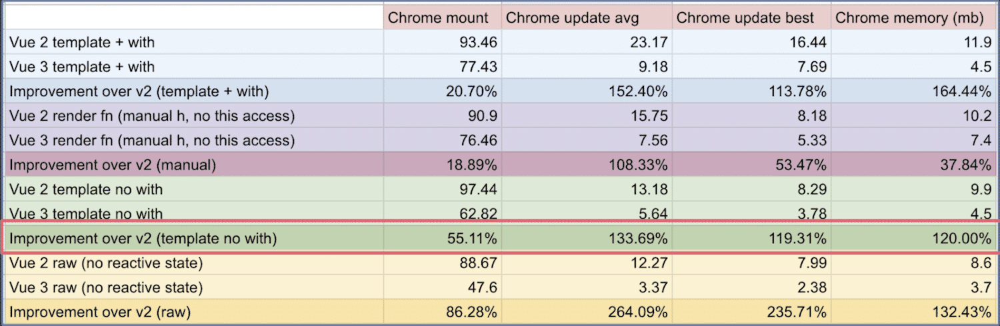

# 解答-1

## Vue3.0 比 Vue2.x 的优势

- 性能更好
- 体积更小
- 更好的 ts 支持
- 更好的代码组织
- 利于复杂逻辑抽离 - Composition API
- 增加了新功能 `Fragment` `Teleport` `Suspense`

虽然有很多更具体的数据，但不用可以去记录这些数据，跟我们日常开发也没有太多关系，了解即可。

## Vue3.0 生命周期

v2.x 的生命周期依然支持，需要注意的是：
- beforeDestroy 改名为 beforeUnmount
- destroyed 改名为 unmounted

新的 Composition API 有了新的生命周期。

看代码演示。

## 你如何看待 Composition API 和 Options API

Composition API 是 vue3 的重要更新，也是使用者们最关注的部分。
- 更好的代码组织
- 更好的逻辑复用 —— 这是两码事儿，后者依赖于前者
- 更好的类型推导

### 代码组织参考例子
- 实际的代码例子
    - v2 https://github.com/vuejs/vue-cli/blob/a09407dd5b9f18ace7501ddb603b95e31d6d93c0/packages/@vue/cli-ui/src/components/folder/FolderExplorer.vue#L198-L404
    - v3 这里有 https://vue-composition-api-rfc.netlify.app/zh/#%E4%BB%A3%E7%A0%81%E7%BB%84%E7%BB%87

### 关于 vue2 中的类型推导
- vue2 中的 this 的方式是比较微妙的。（比如 methods 选项下的函数的 this 是指向组件实例的，而不是这个 methods 对象）
- vue2 设计时，是没有考虑 ts 的类型推导的

### Composition API 和 Options API 如何选择？？
- 不建议共用，会很混乱
- 普通情况下（之前用 vue2.x 也觉得挺好），建议还是继续用 Options API
- 如果系统复杂度比较高，则考虑使用 Composition API ，毕竟需要抽离很多逻辑

### 关于 Composition API 的误解，重要！！！
- 从 vue3 的文档来看，Composition API 隐藏很深，在“高阶指南”里。如果从 0 学习 vue3 你是不太容易接触到它的，普通场景下你甚至都用不到它。它属于一个附加或者高级的额功能。所以，不要把它看的那么重要。
- vue3 也支持 vue2 的 options API ，而且入门文档就是用的 Options API 。这其实就跟 React 的 class 组件和 Hooks 一样了。所以，Composition API 就像是 React Hooks ，是可选的，是为了解决特殊问题的，而不是必须的。
