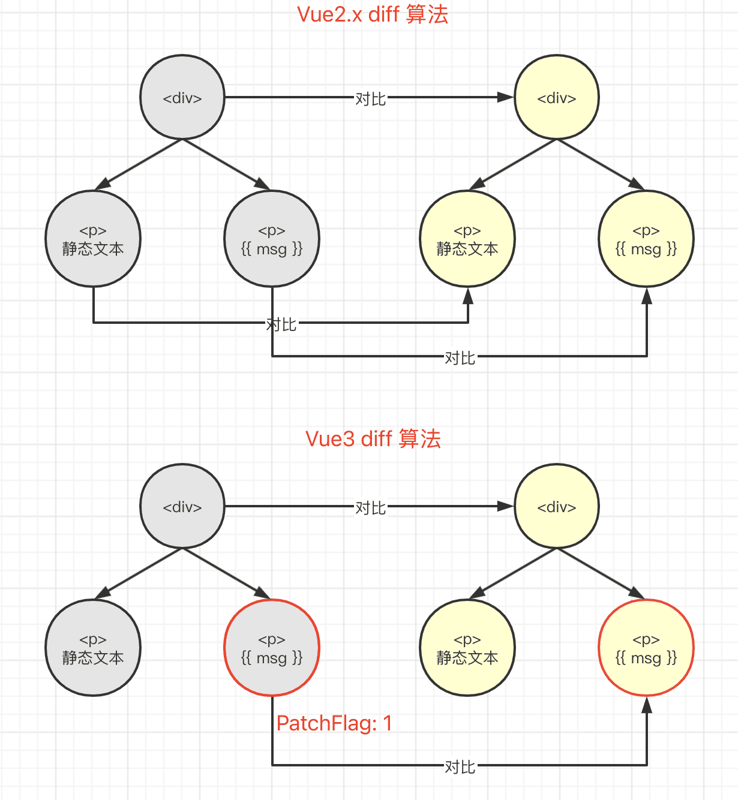

# 解答-5

## Vue3.0 为什么这么快？

- Proxy 实现响应式，初始化时更快。之前已经讲过
- 模板编译优化：静态内容直接输出、数据缓存 —— 所有的算法优化，都是**拿空间换时间**
- diff 算法优化，让组件渲染更快。diff 算法和模板是相关的。PS：其实 diff 算法本身的对比逻辑，跟之前时一样的。可优化的是一些细节和条件分支。
- tree-shaking

*PS：通过 [vue3 template explorer](https://vue-next-template-explorer.netlify.app/) 来体验下面的内容。*

### PatchFlag 静态标记

【案例 1】生成 PatchFlag 是 `1 /* TEXT */`

```html
<div>
  <p>静态文字</p>
  <p>{{ msg }}</p>
</div>
```

```js
import { createVNode as _createVNode, toDisplayString as _toDisplayString, openBlock as _openBlock, createBlock as _createBlock } from "vue"

export function render(_ctx, _cache, $props, $setup, $data, $options) {
  return (_openBlock(), _createBlock("div", null, [
    _createVNode("p", null, "静态文字"),
    _createVNode("p", null, _toDisplayString(_ctx.msg), 1 /* TEXT */)
  ]))
}
```

【案例 2 】生成 PatchFlag 是 `9 /* TEXT, PROPS */`

```html
<div>
  <span>静态文字</span>
  <span :id="hello" class="bar">{{ msg }}</span>
</div>
```

```js
import { createVNode as _createVNode, toDisplayString as _toDisplayString, openBlock as _openBlock, createBlock as _createBlock } from "vue"

export function render(_ctx, _cache, $props, $setup, $data, $options) {
  return (_openBlock(), _createBlock("div", null, [
    _createVNode("span", null, "静态文字"),
    _createVNode("span", {
      id: _ctx.hello,
      class: "bar"
    }, _toDisplayString(_ctx.msg), 9 /* TEXT, PROPS */, ["id"])
  ]))
}
```

即，所有的静态内容都没有 PatchFlag 标记，动态内容都会有。
这个 PatchFlag 到底有什么作用呢？

有了 PatchFlag 就可以区分出来动态节点和静态节点，只对比动态节点即可。



### hoistStatic 静态提升

编译如下模板

```html
<div>
  <span>静态文字1</span>
  <span>静态文字2</span>
  <span>静态文字3</span>
  <span>{{ msg }}</span>
</div>
```

开启 `HoistStatic` 选项，可以看到静态节点全部提升到父作用域去定义，并缓存起来。

典型的“拿空间换时间”的优化方法，缓存就不用重复生成。

还有，如果多个静态节点挨着在一起，超过一定的数量，会被合并起来。
例如编译如下模板

```html
<div>
  <span>静态文字1</span>
  <span>静态文字2</span>
  <span>静态文字3</span>
  <span>静态文字4</span>
  <span>静态文字5</span>
  <span>静态文字6</span>
  <span>静态文字7</span>
  <span>静态文字8</span>
  <span>静态文字9</span>
  <span>静态文字10</span>
  <span>{{ msg }}</span>
</div>
```

到的结果

```js
import { createVNode as _createVNode, toDisplayString as _toDisplayString, createStaticVNode as _createStaticVNode, openBlock as _openBlock, createBlock as _createBlock } from "vue"

const _hoisted_1 = /*#__PURE__*/_createStaticVNode("<span>静态文字1</span><span>静态文字2</span><span>静态文字3</span><span>静态文字4</span><span>静态文字5</span><span>静态文字6</span><span>静态文字7</span><span>静态文字8</span><span>静态文字9</span><span>静态文字10</span>", 10)

export function render(_ctx, _cache, $props, $setup, $data, $options) {
  return (_openBlock(), _createBlock("div", null, [
    _hoisted_1,
    _createVNode("span", null, _toDisplayString(_ctx.msg), 1 /* TEXT */)
  ]))
}
```

### cacheHandler 缓存事件

渲染如下模板

```html
<div>
  <span @click="onClick">
    静态文本
  </span>
</div>
```

开启 `cacheHandlers` 开关，可以看到 onClick 事件会被缓存到 `_cache[1]` 中。

### SSR 时的优化

编译如下模板，输出 SSR

```html
<div>
  <span>静态文字1</span>
  <span>静态文字2</span>
  <span>静态文字3</span>
  <span>{{ msg }}</span>
</div>
```

静态文件直接输出，绕过了 vdom 到 dom 的过程。
这跟 PatchFlag 有点类似。

### tree-shaking

编译以下几段模板，可以看到 `import` 的内容不一样。

```html
<!-- 模板1 -->
<div>
  <span>静态文字</span>
</div>

<!-- 模板2 -->
<div>
  <span>静态文字</span>
  <span>{{ msg }}</span>
</div>

<!-- 模板3 -->
<div>
  <span>静态文字</span>
  <input v-model="msg">
</div>
```

即，针对不通情况，vue 会自动引入所需要的功能，而不会全部引入。
这样就让使用者可以压缩他们项目打包的体积，即 tree-shaking
